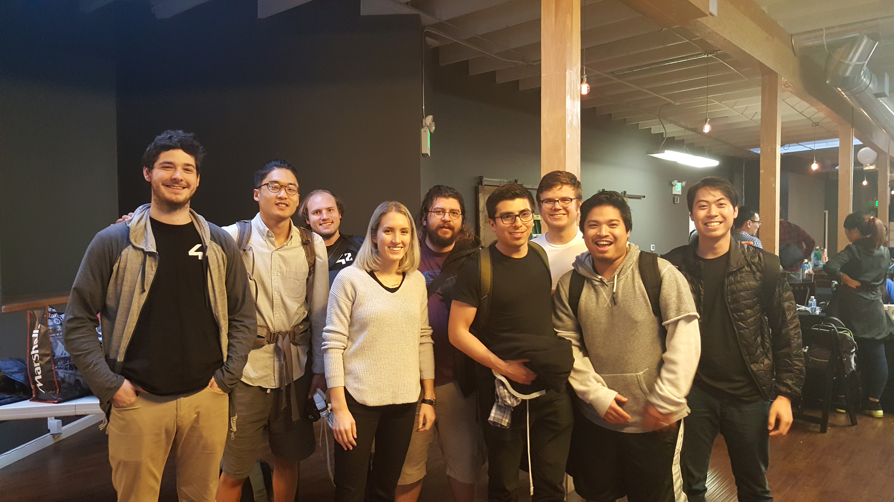

# EXPOSURE VR

## DESCRIPTION:
EXPOSURE VR was a project birthed at the 2016 ATT VR/AR Hackathon. The app was built to provide the public with a tool to combat their phobias through exposure therapy. We built the VR scenes with the A-Frame library (built on three.js). We implemented a recorder library to capture the user's speech and then sent the audio file to Watson's Speech-To-Text api. This API (IBM api's have been my favorite) gave us a JSON file that provided the confidence levels and hesitance from the speech. With this data we implemented our own algorithms to provide the user their clarity, volume, words per minute, and filler/key words.

Built by [John Salangsang](https://github.com/johnsalay), [Miguel Pardo](https://github.com/MigsAdventure), [Dustin Hayes](https://github.com/wowcallmia), [Ziya Emanet](https://github.com/ziyaemanet), and [John Son](https://github.com/Nemsae).

Latest Release: November 11th, 2016.

##
<iframe width="560" height="315" src="https://www.youtube.com/embed/8_CLriUXFVA" frameborder="0" allowfullscreen></iframe>

## TODO:
1. Implement proprietary algos.
2. Create new scene for arachnaphobia.

## TEAM:

## CONTRIBUTORS:
  1. [John Salangsang](https://github.com/johnsalay)
  2. [Miguel Pardo](https://github.com/MigsAdventure)
  3. [John Son](https://github.com/Nemsae)
  4. [Dustin Hayes](https://github.com/wowcallmia)
  5. [Ziya Emanet](https://github.com/ziyaemanet)
